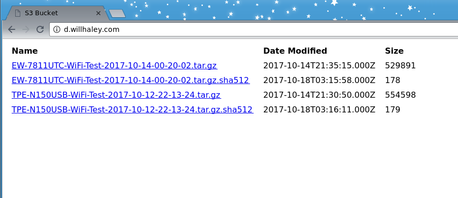

# S3 Directory List

## Demo

[Live Demo](http://d.willhaley.com)



# Why?

I am [well aware](#prior-art) that there are a number of solutions to this problem already. However, a late night brute-force attempt to get them working ran into error after error for me. So, I ([like so many others](#prior-art)) created my own solution.

My implementation is meant to be bare bones and clean. It is (hopefully) a good jumping off point if anyone wants a similar solution.

The key for me was seeing the syntax of an S3 [REST call](http://d.willhaley.com.s3.amazonaws.com/?list-type=2) in action.

This **only supports** listing files with URLs, size, and dates.

[Nolan Lawson's project](https://nolanlawson.com/2013/11/25/s3-bucket-listing-thats-easier-on-the-eyes/) was the best starting off point and provided the most inspiration for my implementation.

# Installation

You **must** update the `index.html` file to use the proper `bucketName` for your site.

Upload the `index.html` and `index.js` files to your bucket.

Enable `Static website hosting` on your bucket and set `index.html` as the `Index document`.

Use the [Bucket Policy](#bucket-policy) and [CORS Configuration](#cors-configuration) examples below bucket. Note, you **must** update the bucket name for _your_ bucket in the `Bucket Policy`.

Set the `Access Control List` on your bucket to grant `List Objects` `Public Access` to `Everyone`.

# Bucket Policy

You **must** update your bucket name in this policy.

```
{
    "Version": "2008-10-17",
    "Statement": [
        {
            "Sid": "PublicReadGetObject",
            "Effect": "Allow",
            "Principal": {
                "AWS": "*"
            },
            "Action": "s3:GetObject",
            "Resource": "arn:aws:s3:::d.willhaley.com/*"
        }
    ]
}
```

# CORS Configuration

```
<?xml version="1.0" encoding="UTF-8"?>
<CORSConfiguration xmlns="http://s3.amazonaws.com/doc/2006-03-01/">
<CORSRule>
    <AllowedOrigin>*</AllowedOrigin>
    <AllowedMethod>GET</AllowedMethod>
    <AllowedMethod>PUT</AllowedMethod>
    <AllowedMethod>POST</AllowedMethod>
    <AllowedMethod>DELETE</AllowedMethod>
    <AllowedHeader>*</AllowedHeader>
</CORSRule>
</CORSConfiguration>
```

# Citations

[GET Bucket (List Objects) Version 2](https://docs.aws.amazon.com/AmazonS3/latest/API/v2-RESTBucketGET.html)

# Prior Art

* [Outdated AWS Sample Code For S3 Bucket Directory Listing](https://aws.amazon.com/code/amazon-s3-bucket-listing/)
* [rufuspollock/s3-bucket-listing](https://github.com/rufuspollock/s3-bucket-listing)
* [caussourd/aws-s3-bucket-listing](https://github.com/caussourd/aws-s3-bucket-listing)
* [nolanlawson/pretty-s3-index-html](https://github.com/nolanlawson/pretty-s3-index-html)
* [rgrp/s3-bucket-listing](https://github.com/rgrp/s3-bucket-listing)
* [juvs/s3-bucket-browser](https://github.com/juvs/s3-bucket-browser)
* [powdahound/s3browser](https://github.com/powdahound/s3browser)
* [adam-p/s3-file-list-page](https://github.com/adam-p/s3-file-list-page)
